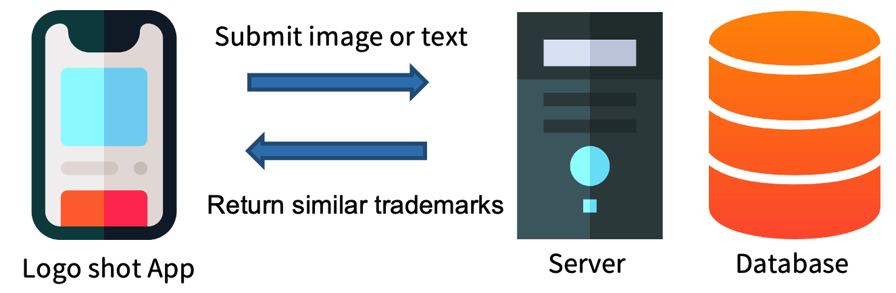

# LOGO SHOT
## Project Introduction
The LOGO SHOT app leverages computer vision, natural language processing, and machine learning for trademark search and generation.

In image search, users submit a trademark image, and through deep learning, the system finds the closest match in the Taiwan trademark database.

In text search, user-input keywords are processed through WordEmbedding for synonym search, and TF-IDF for result expansion.

For trademark creation, Generative Adversarial Networks (GANs) are used with a dataset from the Taiwan trademark database, enabling the generation of new and unique trademarks.

## App Interface
Main Screen|Search Page|
-|-|
||

Search Results Page|Inspiration Page|
-|-|
||

## Download Link
Google Play：https://play.google.com/store/apps/details?id=meow.logoshot

Note: Due to budget constraints, the backend server is currently shut down. Please see the actual demo in the [video](#Introduction_Video) section below。

## Introduction Video
Demo Video (1m 30s): [[Demo Video] Trademark Search and Generation APP – LOGO SHOT](https://www.youtube.com/watch?v=RFrpexPjAhY&ab_channel=%E8%B3%B4%E7%BE%A4%E9%BE%8D)

## Project Architecture

Our application's frontend is designed using React Native, while the backend is powered by Flask, a Python-based framework, utilizing PostgreSQL as the database. Whenever a user submits text or images through the app, our backend server identifies the most similar trademark image within the database and returns it back to the user.